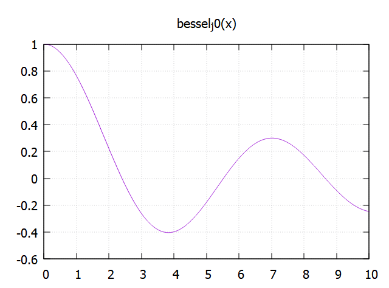

# Calc
Interpreter in Fortran that can handle scalars and 1D arrays, with plotting using gnuplot. Some code the interpreter accepts is

```
! ────────────────────────────────
! General
! ────────────────────────────────
run("code.txt")                     ! run the code in file code.txt
calc code.txt                       ! run the code in code.txt assuming calc is the executable
 
! ────────────────────────────────
! Basic scalars & arithmetic
! ────────────────────────────────
n = 10                              ! define an integer/real scalar variable
r = n / 2                           ! scalar arithmetic (division)
r^3                                 ! exponentiation of a scalar

! ────────────────────────────────
! Creating vectors (array literals, arange, grid)
! ────────────────────────────────
y = [1, 2, 3, 4, 5]                 ! literal real-vector (commas or blanks both work)
v = 10 * arange(10)                 ! 1-based sequence [1,2,…,10] scaled by 10
t = grid(11, 0.0, 0.1)              ! uniform grid: 11 points starting 0.0, step 0.1

! ────────────────────────────────
! Element-wise arithmetic between vectors & scalars
! ────────────────────────────────
z = n * y                           ! scalar–vector multiplication
w = y + v(1:size(y))                ! vector + vector (same length sub-slice of v)
z ^ 2                               ! element-wise power; returns a vector

! ────────────────────────────────
! Vector subscripting & slicing
! ────────────────────────────────
v([2 4 6 8])                        ! arbitrary position lookup (2,4,6,8)
v(3:9:2)                            ! Fortran-style slice: start 3, stop 9, stride 2
reverse(v)                          ! elements of v in reverse order              
! ────────────────────────────────
! Random numbers
! ────────────────────────────────
x  = runif(10)                      ! 10 iid uniform(0,1) deviates
x0 = runif()                        ! single uniform deviate (same as runif(1))
rn = rnorm(5)                       ! 5 iid standard-normal deviates
rnorm(10^3)                         ! 1000 iid normals; large vectors are summarized

! ────────────────────────────────
! Descriptive statistics
! ────────────────────────────────
sum(x)                              ! sum of elements
mean(x)                             ! arithmetic mean
geomean(x)                          ! geometric mean = product(x) ^ (1/size(x))
harmean(x)                          ! harmonic mean  = size(x) / sum(1/x)
sd(x)                               ! sample standard deviation
[mean(x) sd(x) minval(x) maxval(x)] ! combining multiple scalar results in a vector
median(x)                           ! sample median
rank(x)                             ! competition ranks (1 = smallest value)
stdz(x)                             ! z-scores (zero mean, unit variance)

! ────────────────────────────────
! Cumulative & difference operations
! ────────────────────────────────
cumsum(y)                           ! running sum
cumprod(y)                          ! running product
diff(y)                             ! first difference (y(i+1)-y(i))

! ────────────────────────────────
! Sorting & ordering
! ────────────────────────────────
sort(x)                             ! ascending copy of x
indexx(x)                           ! permutation that sorts x
y(indexx(y))                        ! explicit use of ordering to sort y

! ────────────────────────────────
! Head & tail utilities
! ────────────────────────────────
head(v)                             ! first 5 elements (default n = 5)
tail(v)                             ! last 5 elements

! ────────────────────────────────
! Relational comparisons (broadcasting rules)
! ────────────────────────────────
x > 0.5                             ! vector–scalar comparison; 1 = true, 0 = false
x <= maxval(x)                      ! always true → all ones
y == [1 2 3 4 5]                    ! element-wise equality (vector–vector)
y /= 3                              ! inequality with scalar
y >= 4                              ! “greater-or-equal” test

! ────────────────────────────────
! Two-vector functions
! ────────────────────────────────
cor(x, sort(x))                     ! Pearson correlation of two equal-length vectors
cov(x, sort(x))                     ! covariance
dot(y, v(1:size(y)))                ! dot product of two length-5 vectors
min(y, v(1:size(y)))                ! element-wise minima between two vectors
max(x, 0.5)                         ! element-wise maximum with a scalar

! ────────────────────────────────
! Inspect currently defined variables
! ────────────────────────────────
?vars                               ! list all variables and their current values

! ────────────────────────────────
! Clean up workspace
! ────────────────────────────────
clear                               ! remove all user-defined variables
```

A sample session is
```
> n = 10
10.000000

> y = [1, 2, 3]
[1.000000 2.000000 3.000000]

> z = n * y
[10.000000 20.000000 30.000000]

> w = [10 20 30] + y
[11.000000 22.000000 33.000000]

> z ^ 2
[100.000000 400.000000 900.000000]

> x = runif(n)
[.704414 .208529 .550907 .377847 .189410 .223593 .262786 .870069 .568524 .569907]

> sum(x)
4.525986

> [sum(x) minval(x) maxval(x)]
[4.525986 .189410 .870069]

> q
```

The semicolon `;` is the continuation character, as in Fortran. It suppresses output when it appears at the end of the line, as in Matlab. Iteration is done by starting a line with `*n`, which means execute the rest of the line n times. Thus the code

```
a = 3
x = 1
*5  x = (x + a/x)/2 ! Newton's method for square root
```
will perform 5 Newton iterations to compute the square root of 3, giving

```
> 2
1.750000
1.732143
1.732051
1.732051
```
Plotting with gnuplot is possible with code such as

```
x = arange(1000)/100;
plot(x,bessel_j0(x))
```



